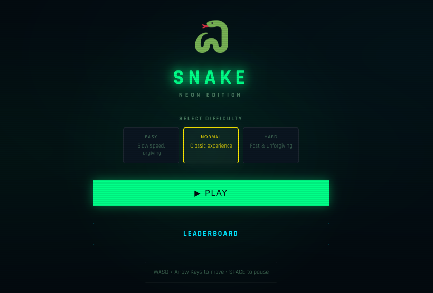

# 🐍 Snake — Neon Edition

A Snake game built with **SvelteKit + PixiJS** (frontend) and **Node.js + Express** (backend). 
## Features

- **PixiJS rendering** — smooth WebGL-accelerated game graphics
- **Svelte frontend** — reactive UI with no boilerplate
- **Node.js backend** — persistent leaderboard with file-based storage
- **3 difficulty levels** — Easy / Normal / Hard
- **Food types** — Normal (red circle  🔴 ), Bonus star (yellow ⭐), Super diamond (cyan 💎)
- **Particle effects** — burst animations on eating food
- **Level progression** — speed increases every 100 points per level
- **Leaderboard** — top 10 scores saved to backend
- **Mobile D-pad** — touchscreen-friendly controls
- **Retro neon aesthetic** — scanlines, glow effects, pixel font

##  Structure

```
snake-game/
├── frontend/          # SvelteKit + PixiJS app
│   ├── src/
│   │   ├── lib/
│   │   │   ├── SnakeGame.ts      # Core PixiJS game engine
│   │   │   ├── GameCanvas.svelte # Canvas wrapper component
│   │   │   ├── HUD.svelte        # Score / level display
│   │   │   ├── Leaderboard.svelte
│   │   │   ├── DPad.svelte       # Mobile controls
│   │   │   └── api.ts            # Backend API service
│   │   ├── routes/
│   │   │   ├── +page.svelte      # Main game page (all screens)
│   │   │   └── +layout.svelte
│   │   ├── stores/
│   │   │   └── game.ts           # Svelte stores for game state
│   │   └── app.css               # Global retro neon styles
│   └── package.json
└── backend/           # Node.js Express API
    ├── src/
    │   └── index.js   # Express server with leaderboard endpoints
    ├── data/          # Auto-created, stores leaderboard.json
    └── package.json
```

##  Getting Started

### 1. Start the Backend

```bash
cd backend
npm install
npm run dev
# Server runs at http://localhost:3001
```

### 2. Start the Frontend

```bash
cd frontend
npm install
npm run dev
# App runs at http://localhost:5173
```

### 3. Play!

Open [http://localhost:5173](http://localhost:5173) in your browser.

## Controls

| Key             | Action      |
|-----------------|-------------|
| Arrow Keys / WASD | Move snake |
| Space / Escape  | Pause/Resume |
| Mobile D-pad    | Touch controls |

##  Food Types

| Food    | Shape   | Points  |
|---------|---------|---------|
| 🔴 Normal  | Circle  | 10 × level |
| ⭐ Bonus   | Star    | 30 × level (expires!) |
| 💎 Super   | Diamond | 60 × level (rare, expires!) |

##  API Endpoints

| Method | Path          | Description         |
|--------|---------------|---------------------|
| GET    | `/leaderboard` | Top 10 scores      |
| POST   | `/leaderboard` | Submit score       |
| GET    | `/health`      | Server health check|

### POST `/leaderboard` body:
```json
{
  "name": "PLAYER1",
  "score": 1240,
  "level": 3
}
```

##  Tech Stack

- **Frontend**: SvelteKit, TypeScript, PixiJS 7
- **Backend**: Node.js 18+, Express 4, CORS
- **Fonts**: Press Start 2P (pixel), Rajdhani (UI)
- **Storage**: JSON file (swap for any database easily)
